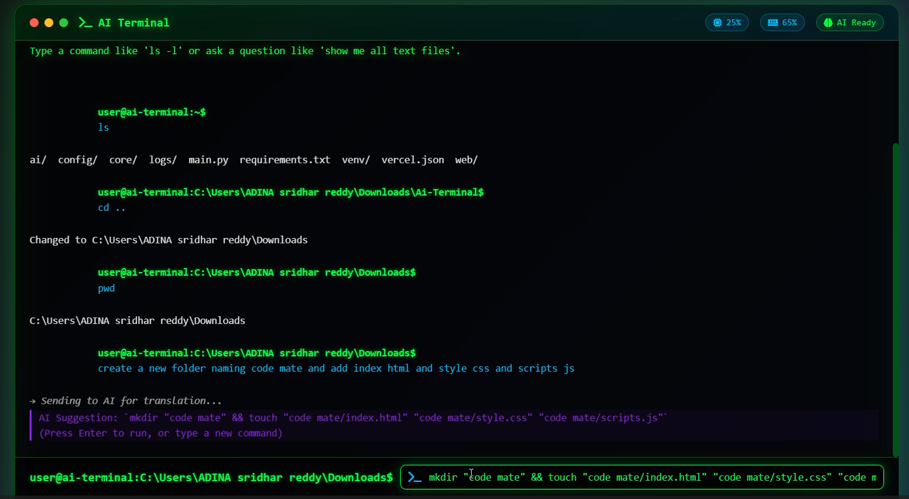

# 🤖 AI-Powered Terminal

[](https://www.python.org/)
[](https://github.com/rakeshreddyadina/AI-Terminal)

A next-generation web-based terminal that combines traditional command-line functionality with AI-powered natural language processing. Execute commands naturally by describing what you want to do, or use traditional shell commands - all through an elegant, modern web interface.



## ✨ Features

### 🧠 AI-Powered Command Translation
- **Natural Language Processing**: Type "show me all text files" instead of `find . -name "*.txt"`
- **Intelligent Command Suggestions**: AI translates your intentions into precise shell commands
- **Context-Aware**: Understands your current directory and available files
- **Google Gemini Integration**: Powered by Google's advanced language model

### 🖥️ Modern Terminal Experience
- **Web-Based Interface**: Access from any browser, no installation required
- **Real-Time System Monitoring**: Live CPU, memory, and system stats in the header
- **Smart Input Mode Detection**: Automatically switches between command and AI modes
- **Command History & Autocomplete**: Full history navigation and intelligent suggestions
- **Responsive Design**: Works seamlessly on desktop and mobile devices

### 🔒 Security & Safety
- **Command Whitelisting**: Only safe, approved commands are executed
- **Destructive Command Protection**: Confirmation dialogs for potentially dangerous operations
- **Sandboxed Execution**: Isolated command execution environment
- **Permission Controls**: Built-in safeguards against system-altering commands

### ⚡ Built-in Commands
- **File Operations**: `ls`, `cat`, `mkdir`, `rm`, `cp`, `mv`, `find`, `grep`
- **System Info**: `ps`, `df`, `du`, `uname`, `whoami`, `date`
- **Text Processing**: `head`, `tail`, `echo`, `touch`
- **Navigation**: `cd`, `pwd`, `history`, `clear`

## 🚀 Quick Start

### Prerequisites
- Python 3.7 or higher
- Google API key (get one [here](https://aistudio.google.com/app/apikey))

### Installation

1. **Clone the repository**
   ```bash
   git clone https://github.com/rakeshreddyadina/AI-Terminal.git
   cd AI-Terminal
   ```

2. **Configure your API key**
   
   Open `config/settings.py` and add your Google API key:
   ```python
   GOOGLE_API_KEY = "your-api-key-here"
   ```

3. **Run the application**
   ```bash
   python main.py
   ```

4. **Access the terminal**
   
   Open your browser and navigate to `http://localhost:5000`

That's it! The application will automatically install required dependencies and start the web server.

## 🎯 Usage Examples

### Traditional Commands
```bash
ls -la
cd Documents
cat README.md
ps aux | grep python
```

### Natural Language Commands
```
show me all Python files
find large files in this directory
what processes are using the most memory
create a backup of my project folder
```

### AI Translation Examples
| Natural Language | Generated Command |
|-----------------|-------------------|
| "list all hidden files" | `ls -la` |
| "find Python files" | `find . -name "*.py"` |
| "show disk usage" | `df -h` |
| "search for 'TODO' in code files" | `grep -r "TODO" --include="*.py" .` |

## 🛠️ Architecture

```
AI-Terminal/
├── main.py                 # Application entry point
├── config/
│   └── settings.py         # Configuration and API keys
├── web/
│   ├── app.py             # Flask application factory
│   ├── templates/
│   │   └── index.html     # Main UI template
│   └── static/
│       ├── css/
│       │   └── terminal.css # Modern terminal styling
│       └── js/
│           ├── terminal.js  # Frontend terminal logic
│           └── websocket.js # Real-time communication
├── core/
│   ├── terminal.py        # Core terminal functionality
│   ├── command_executor.py # Safe command execution
│   ├── system_monitor.py  # System resource monitoring
│   └── file_manager.py    # File operations
├── ai/
│   └── model_manager.py   # Google Gemini integration
└── logs/
    └── logger.py          # Logging configuration
```

## 🔧 Configuration

### Environment Variables
You can also configure the API key via environment variable:
```bash
export GOOGLE_API_KEY="your-api-key-here"
python main.py
```

### Customization Options

Edit `config/settings.py` to customize:
- **AI Model**: Change `AI_MODEL_NAME` to use different Gemini models
- **Security**: Modify `ALLOWED_COMMANDS` and `BLOCKED_COMMANDS`
- **Timeouts**: Adjust command execution timeouts
- **Monitoring**: Configure system monitoring intervals

## 🚨 Security Features

### Command Filtering
- **Whitelist Approach**: Only pre-approved commands can execute
- **Blocked Commands**: Destructive commands like `rm -rf`, `sudo`, `shutdown` are blocked
- **Path Validation**: Prevents directory traversal attacks
- **Input Sanitization**: All inputs are properly sanitized

### Safe Execution
- **Timeout Protection**: Commands automatically timeout to prevent hanging
- **Resource Limits**: Built-in protections against resource exhaustion
- **Process Isolation**: Commands run in controlled environments
- **Error Handling**: Comprehensive error catching and logging

## 📊 System Requirements

- **Memory**: Minimum 512MB RAM
- **Disk Space**: 100MB for application and logs
- **Network**: Internet connection required for AI features
- **Browser**: Modern browser with WebSocket support

## 🐛 Troubleshooting

### Common Issues

**AI features not working**
- Verify your Google API key in `config/settings.py`
- Check your internet connection
- Ensure your API key has proper permissions

**Commands not executing**
- Check if the command is in the allowed list
- Review logs in the `logs/` directory
- Verify file permissions

**Web interface not loading**
- Ensure port 5000 is not in use
- Check firewall settings
- Verify all dependencies are installed

### Debug Mode
Enable debug logging by setting `DEBUG = True` in `config/settings.py`.

## 📝 Contributing

We welcome contributions! Here's how to get started:

1. Fork the repository
2. Create a feature branch (`git checkout -b feature/amazing-feature`)
3. Commit your changes (`git commit -m 'Add amazing feature'`)
4. Push to the branch (`git push origin feature/amazing-feature`)
5. Open a Pull Request

### Development Setup
```bash
# Clone the repository
git clone https://github.com/rakeshreddyadina/AI-Terminal.git
cd AI-Terminal

# Install development dependencies (if available)
pip install -r requirements.txt

# Run the application
python main.py

# The application will automatically handle dependency installation
```

## 📈 Project Status

This project is actively maintained and developed. Current version includes:
- ✅ Full AI-powered command translation
- ✅ Real-time system monitoring
- ✅ Secure command execution
- ✅ Modern web interface
- ✅ WebSocket communication
- 🔄 Continuous improvements and feature additions

## 📋 FAQ

**Q: Is this safe to use on my system?**
A: Yes! The terminal uses a whitelist approach for commands and blocks all destructive operations. All commands run with your user permissions, not as root.

**Q: Do I need an internet connection?**
A: Yes, for AI features. Traditional commands work offline, but natural language processing requires internet access to communicate with Google's Gemini API.

**Q: Can I add custom commands?**
A: Yes! You can extend the built-in commands by modifying the `builtin_commands` dictionary in `core/terminal.py`.

**Q: What happens if my API quota is exceeded?**
A: The terminal gracefully falls back to showing an error message. Traditional commands continue to work normally.

---

<div align="center">
  <strong>Built with ❤️ by the AI Terminal</strong>
  <br>
  <sub>Making command-line interfaces more human</sub>
</div>